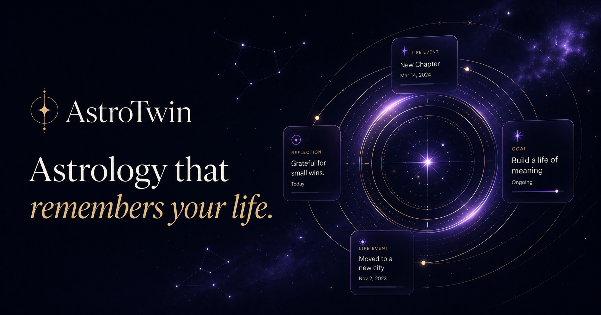

# AstroTwin

### Astrology that remembers your life.

AstroTwin is a full-stack product prototype built for **AstroHack 2026: Build the Next Universe**.

It reimagines AstroLive from a transactional consultation marketplace into a **persistent astrology companion** that combines Vedic chart computation, user-controlled life context, daily reflection, memory-aware AI guidance, shareable compatibility experiences, and timely human consultation.

> **Responsible-use note:** Astrology interpretations in AstroTwin are belief-based reflections. They are not scientifically validated predictions and should not replace professional medical, legal, financial, or mental-health advice.


---

## The Product Opportunity

A typical astrology consultation journey often looks like:

```text
Ask → Consult → Pay → Leave
```

This works for urgent questions, but it creates three product gaps:

* users have limited reasons to return between consultations,
* important context is lost between interactions,
* every new session can feel like starting from zero.

AstroTwin introduces a **persistent astrology identity** that connects a user's birth chart with the goals, milestones, memories, questions, and reflections they choose to save.

That creates a compounding engagement loop:

```text
Profile
   ↓
Guidance
   ↓
Reflection
   ↓
Memory
   ↓
Better Personalization
   ↓
Higher Relevance
   ↓
Retention
   └──────────────→ Human Consultation
```

More context improves future guidance, creating stronger continuity over time.

---

## AstroCircle: The Viral Loop

AstroCircle adds a product-native acquisition mechanism through shareable compatibility reflections.

```text
Existing User
      ↓
AstroCircle
      ↓
Compatibility Reflection
      ↓
Public Share Link
      ↓
Friend Opens Report
      ↓
Create Your Own AstroTwin
      ↓
New User
```

Instead of relying only on referral campaigns, sharing becomes part of the product experience itself.

---

# Core Product Experience

## 1. Persistent AstroTwin Profile

Users can:

* create an account,
* sign in and sign out,
* maintain a private profile,
* save goals, memories, events, and reflections,
* retain context across sessions.

---

## 2. Computed Vedic Chart

AstroTwin calculates a Vedic chart using:

* Lahiri sidereal zodiac,
* Lagna,
* planetary positions,
* whole-sign houses,
* Janma Nakshatra,
* Nakshatra Pada,
* current sidereal transits,
* approximate Vimshottari Mahadasha.

The computation layer uses **Swiss Ephemeris**, keeping structured astrology calculations separate from AI interpretation.

---

## 3. Ask AstroTwin

AstroTwin provides memory-aware, chart-grounded conversational guidance.

The conversation engine combines:

* computed birth-chart data,
* selected user memories,
* upcoming life events,
* recent conversation context,
* user questions.

When configured, responses are generated using **Groq-hosted `openai/gpt-oss-120b`**.

If the hosted provider is unavailable, AstroTwin automatically falls back to a deterministic local Vedic interpretation layer.

The prototype therefore remains functional without an external AI key.

---

## 4. Persistent Memory

Users control the context AstroTwin remembers.

Supported memory includes:

* personal goals,
* important milestones,
* career events,
* relationship events,
* reflections,
* saved conversation insights.

Users can inspect, add, edit, and delete their stored memories.

---

## 5. Cosmic Daily

Cosmic Daily creates a lightweight habit loop through daily reflective guidance.

It includes:

* daily transit-informed signals,
* personalized guidance,
* recommended actions,
* upcoming-event awareness,
* daily mood reflection,
* resonance check-ins.

Repeated reflections contribute to the user's personal resonance history.

---

## 6. Life Timeline

The Life Timeline stores meaningful milestones such as:

* interviews,
* exams,
* project reviews,
* relationship milestones,
* career decisions,
* personal events.

Relevant events can then be surfaced in future AstroTwin conversations and daily guidance.

---

## 7. AstroCircle

AstroCircle creates deterministic compatibility reflections for:

* relationships,
* friendships,
* co-founders,
* teams,
* roommates.

Each report includes reflective scores and a public share link.

The public report can be opened without authentication and includes a CTA to create a new AstroTwin profile.

> AstroCircle is a reflective product mechanic, not a scientifically validated compatibility assessment or complete Vedic synastry engine.

---

## 8. AstroConnect

AstroConnect detects higher-intent user situations and recommends relevant human astrologers.

Examples include:

* career uncertainty,
* relationship concerns,
* major life decisions.

Users can:

* browse astrologers,
* filter by specialization,
* open astrologer profiles,
* choose chat or call,
* select a time slot,
* complete a prototype booking.

This creates a natural path from:

```text
AI Guidance → High Intent → Human Consultation
```

---

## 9. Demo Analytics

The project includes a presentation-oriented analytics dashboard covering:

* engagement,
* retention,
* AstroTwin questions,
* AstroCircle sharing,
* astrologer recommendations,
* booking conversion,
* virality indicators.

Seeded analytics are explicitly labelled as **illustrative demo assumptions**, not real AstroLive customer metrics.

---

# Judge Demo

No credentials are required for the main walkthrough.

Select **Explore Demo** to activate the pre-seeded fictional profile **Anshika**, including:

* a computed Vedic chart,
* memories,
* upcoming milestones,
* daily guidance,
* historical reflections,
* AstroCircle data,
* illustrative analytics.

## Recommended 3-Minute Walkthrough

### 1. Dashboard + Vedic Chart

Open the populated dashboard and inspect the computed chart.

### 2. Ask AstroTwin

Ask:

> What does my Vedic chart suggest for my upcoming interview?

Then follow up:

> How should I prepare for that pattern?

The second response preserves conversational and saved context.

### 3. Life Timeline

Open the timeline and inspect the relevant milestone used by AstroTwin.

### 4. AstroCircle

Generate a compatibility reflection and copy its public share link.

Open the link separately to demonstrate the viral acquisition loop.

### 5. AstroConnect

Ask a high-intent career or relationship question.

Open the recommended astrologer and complete the prototype booking flow.

### 6. Demo Analytics

Finish with the analytics dashboard to connect the product experience to retention, virality, and monetization.

Judges can also create a separate account using their own birth details.

The demo profile and seeded metrics are clearly labelled and are never presented as real customer results.

---

# What Is Real vs. Prototype Logic

| Capability                 | Implementation                                                                                            |
| -------------------------- | --------------------------------------------------------------------------------------------------------- |
| **Birth chart**            | Calculated from date, exact time, coordinates, and timezone using Swiss Ephemeris in Lahiri sidereal mode |
| **Location resolution**    | Open-Meteo geocoding with an offline fallback index for common Indian cities                              |
| **Accounts & sessions**    | Persisted accounts, PBKDF2-HMAC-SHA256 password hashes, signed HTTP-only cookies                          |
| **User data**              | SQLAlchemy persistence using SQLite locally or PostgreSQL in deployment                                   |
| **AstroTwin conversation** | Structured chart/context interpretation through Groq GPT-OSS 120B with local deterministic fallback       |
| **Daily signals**          | Deterministic signals derived from sidereal transit-house relationships                                   |
| **AstroCircle**            | Deterministic reflective scoring; not complete Vedic synastry                                             |
| **Booking**                | Persisted prototype booking confirmation; no real payment, call, or live availability integration         |
| **Demo analytics**         | Illustrative assumptions combined with recorded prototype events                                          |

---

# Architecture

```text
Browser
   │
   ▼
Next.js 15 + TypeScript
   │
   │ Credentialed REST requests
   ▼
FastAPI + Pydantic + SQLAlchemy
   │
   ├── Authentication & ownership checks
   ├── Swiss Ephemeris Vedic engine
   ├── Memory & life-event services
   ├── Chat & context orchestration
   ├── AstroCircle sharing
   ├── Booking & analytics
   ├── Groq → GPT-OSS 120B
   └── Deterministic local fallback
   │
   ▼
SQLite / PostgreSQL
```

---

# Repository Structure

```text
AstroLive/
├── frontend/                 # Next.js application and typed API client
├── backend/
│   ├── app/                  # API, models, schemas, seed and services
│   └── tests/                # Product, security and engine tests
├── docs/                     # Hackathon report notes and AI disclosure
├── render.yaml               # Render infrastructure blueprint
├── .env.example              # Safe configuration example
└── README.md
```

---

# Technology Stack

## Frontend

* Next.js 15
* React
* TypeScript
* Framer Motion
* Recharts
* Lucide

## Backend

* FastAPI
* Pydantic
* SQLAlchemy
* psycopg

## Astrology

* Swiss Ephemeris
* Lahiri ayanamsa
* whole-sign houses

## AI Interpretation

* Groq Chat Completions
* `openai/gpt-oss-120b`
* deterministic local fallback

## Persistence

* SQLite for local development
* PostgreSQL-compatible deployment architecture

---

# Responsible Design & Data Handling

AstroTwin is designed around reflective guidance rather than guaranteed prediction.

The system avoids:

* medical diagnosis,
* guaranteed financial outcomes,
* guaranteed relationship outcomes,
* scientific claims about astrology,
* crisis handling through astrology.

Medical emergencies, self-harm situations, legal crises, and guaranteed-return financial requests are routed away from astrology advice.

Users can inspect, edit, and delete their stored memories and events.

Private records are checked against the authenticated account before access.

Passwords are never stored directly.

Authentication uses:

* PBKDF2-HMAC-SHA256 password hashing,
* unique salts,
* signed session cookies,
* expiring sessions,
* HTTP-only cookies,
* secure cookies in production.

When Groq is enabled, selected structured chart information, relevant user context, and the current question are sent to Groq for interpretation.

The API key remains server-side.

If Groq is unavailable or no key is configured, AstroTwin continues functioning through the local fallback provider.

Public AstroCircle pages contain only information deliberately included in the shared report.

See:

```text
docs/AI_DISCLOSURE.md
```

for the project's AI-use disclosure.

---

# Local Development

## Prerequisites

* Python 3.11+
* Node.js 20+
* Corepack / pnpm

---

## Backend

From the repository root:

```bash
cd backend
py -3.12 -m venv .venv
.venv\Scripts\activate.bat
python -m pip install -r requirements.txt
copy .env.example .env
python -m uvicorn app.main:app --reload --port 8000
```

Example `backend/.env`:

```env
DATABASE_URL=sqlite:///./astrotwin.db
FRONTEND_URL=http://localhost:3000

SESSION_SECRET=replace-with-a-long-random-secret
SESSION_COOKIE_SECURE=false

GROQ_API_KEY=your-groq-key
GROQ_MODEL=openai/gpt-oss-120b
GROQ_BASE_URL=https://api.groq.com/openai/v1
```

`GROQ_API_KEY` is optional for local development.

Without it, AstroTwin uses the local fallback provider.

The backend runs at:

```text
http://localhost:8000
```

FastAPI interactive documentation is available at:

```text
http://localhost:8000/docs
```

---

## Frontend

Open a second terminal from the repository root:

```bash
cd frontend
copy .env.example .env.local
corepack pnpm install --frozen-lockfile
corepack pnpm dev
```

Example `frontend/.env.local`:

```env
NEXT_PUBLIC_API_URL=http://localhost:8000
NEXT_PUBLIC_APP_URL=http://localhost:3000
```

Open:

```text
http://localhost:3000
```

---

# Product Success Metrics

## Retention

* D1 return rate
* D7 return rate
* daily guidance opens
* reflection completion rate

## Engagement

* AstroTwin questions per user
* memories per user
* life events per user
* active days per user

## Virality

* AstroCircle shares per active user
* public report open rate
* share-to-profile conversion
* viral coefficient

A simple viral coefficient can be expressed as:

```text
K = shares per active user × share-to-signup conversion
```

## Monetization

* astrologer recommendation rate
* recommendation → profile click-through
* astrologer profile → booking conversion
* bookings per active user

Seeded values in the prototype are illustrative assumptions.

Production targets require real baseline data and experimentation.

---

# Prototype Limitations

AstroTwin is a hackathon prototype and intentionally leaves some production concerns out of scope.

Current limitations include:

* astrology interpretations are belief-based and do not guarantee outcomes,
* Vimshottari boundaries are approximate at day-level precision,
* advanced features such as divisional charts, yogas, shadbala, and birth-time rectification are outside scope,
* AstroCircle is not complete Vedic synastry,
* bookings do not collect payments,
* bookings do not initiate real voice/chat consultations,
* astrologer availability is simulated,
* hosted AI usage is subject to provider rate limits,
* deterministic fallback logic is used when hosted AI is unavailable.

---

# Product Thesis

> **AstroTwin turns AstroLive from a place users visit when they have a question into a product that grows with their life.**

By combining persistent context, computed astrology, daily reflection, social discovery, and well-timed human consultation, AstroTwin creates a single product loop connecting:

**retention → relevance → virality → monetization**
